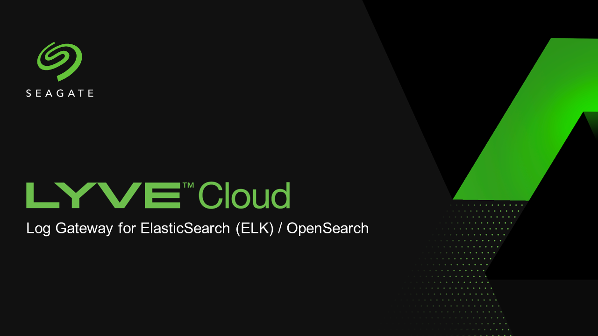
# Log Gateway for OpenSearch and ElasticSearch (ELK)


A parsing utility is available to assist with extracting, loading, and transforming (ETL) Lyve Cloud Logs (specifically, the API Audit Log) into ElasticSearch / OpenSearch. The resulting logs can be further visualized and analyzed within Kibana / OpenSearch Dashboard (OSD).

This utility program can function as either a standalone application on Windows/Linux-based platforms or as a container service on Docker (i.e., on-cloud). Users can either execute the program manually or set up a schedule using the [`cron`](https://crontab.guru/) scheduling syntax."


<br/>
<br/>

## Table of contents
---
* [Overview](#overview)
* [Prerequisites](#prerequisites)
* [Known Limitations](#known-limitations)
* [Installation](#installation)
  * [System Readiness Check](#system-readiness-check)
  * [Initialize Data Stream Index and Data Policy](#initialize-data-stream-index-and-data-policy)
* [Usage](#usage)
  * [Discover Your Data](#discover-your-data)
  * [Dashboard and Visualization](#dashboard-and-visualization)
  * [Import Saved Objects](#import-saved-objects)
* [Status](#status)
* [To Do Lists](#to-do-lists)
* [GitLab Repository](#gitlab-repository)
* [Tested by](#tested-by)
* [Contact](#contact)
* [License](#license)

<br/>
<br/>

## Overview
---
To ingress Lyve Cloud Logs (particularly the S3 API Audit Logs) into OpenSearch or ElasticSearch, log data can be directly ingressed into the target platform without any data manipulation or pre-processing by using a native client library such as [`opensearch-py`](https://opensearch-project.github.io/opensearch-py/) or [`elasticsearch`](https://elasticsearch-py.readthedocs.io/en/v8.6.0/). However, this approach is recommended for preliminary data discovery only since it lets OpenSearch/ElasticSearch decide how to manage the data (e.g., data types, data retention).

To ensure about data integrity and reliability, a parser engine that performs Extract-Transform-Load (ETL) is built for this purpose. The parser engine provides:
- Explicit data type mappings.
- Explicit data retention / data life cycle management.
- Auto adding of the `"@timestamp"` field attribute at a default time reference index for convenience. This field is required by Kibana / OpenSearch Dashboard. For example, the API Audit Logs is using `"auditEntry.time"` as a timestamp. The parser engine will copies its value and assigns it into `"@timestamp"`.
- Automated parsing of durations with units such as "timeToResponse": "230061765ns" will be corrected and stored without the "ns" suffix.


Below is a system architecture for this parsing utility.

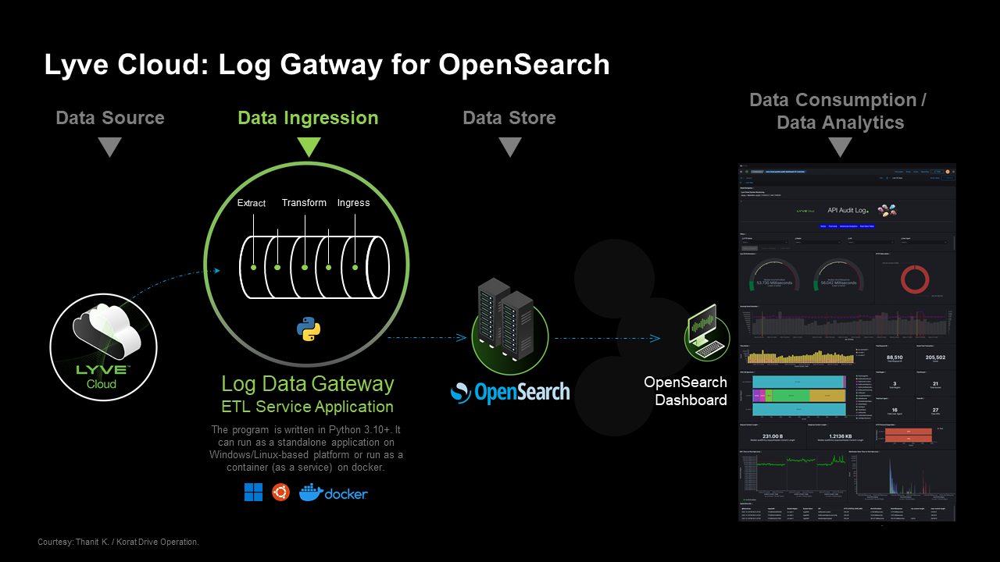


[Back to top](#top)
<br/>
<br/>


## Prerequisites
---
- [`Python`](https://www.python.org) v3.10 and above is required.
- Client library [`opensearch-py`](https://opensearch-project.github.io/opensearch-py/) or [`elasticsearch`](https://elasticsearch-py.readthedocs.io/en/v8.6.0/).
- Lyve Cloud
    - Access Key (`access_key`)
    - Secret Key `secret_key`)
    - Bucket name (`log_bucket`)
    - Endpoint URL (`endpoint_url`)

- Data Analytics Platform
    - [`OpenSearch`](https://opensearch.org/) v2.4.x (or above) and OpenSearch Dashboard (built-in with the Opensearch stack)
        - Credentials (`authentication_mode`)
            - Option 1 (`basic`): requires `username` and `password`
            - ~~Option 2 (`api_key`):~~ -- not yet supported by the Opensearch itself.
        - CA certificate (optional)
        - Ensure that the user account have these Cluster Permissions.
            - Not required.
        - Ensure that the user account have these Index Permissions.
            - `indices:data/write/*`
            - `indices:data/read/*`
            - `indices:admin/get (retrieve index and mapping)`
            - `indices:admin/index_template/*`
            - `indices:admin/mapping/*`


[Back to top](#top)
<br />
<br />

## Known Limitations
---
There are limitations and functionality gaps to handle before this sample code can be used in a production environment:
* Credentials are kept in a clear text.
* This document will be using **OpenSearch v2.4.1** as a guidline.
* We cannot guarantee foolproof protection against duplicate records in the OpenSearch data index when running a program multiple times with the same start/stop time period, as history tracking may be missing or some of the older records may have been deleted.

[Back to top](#top)
<br />
<br />


## Installation
---

> Noted: For **OpenSearch/ElasticSearch** installation, please follow their guidline on the website. We assumed that you have all [prerequisites](#prerequisites) as described above.

<br />

### **Step 1:** Install Python 3.10+ and dependecies
After installing [`Python`](https://www.python.org), please install all required dependency packages by typing the following command in the command line prompt. Please note that you may need administrator privileges.

```
pip install -r requirements.txt
```

### **Step 2:** Set up the **`config.yaml`** configuarations
Please fill in and complete the relevant configurations as the example below.

@ **`config.yaml`**
```yaml
# Data Source
lyvecloud:
  access_key: 'XXXXXXXXXXXXXXXX'
  secret_key: 'XXXXXXXXXXXXXXXXXXXXXXXXXXXXXXXX'
  log_bucket: 'my-lyve-log-bucket'
  endpoint_url: 'https://s3.us-east-1.lyvecloud.seagate.com'


# Data Destination
destination:
  - opensearch

# Data Destination and its settings
opensearch:
  stack_version: '2.x.x'

  # URL format: <protocol>://<hostname or ip address>:<port>
  server_url: 'https://my.opensearch.com:9660'
  dashboard_url: 'http://my.opensearch.com:9662'
  tenant: 'lyve-cloud-system-monitoring'

  # Authentication Mode. Available options: ['basic', 'api_key', 'cloud_id']
  authentication_mode: 'basic'
  credentials:
    - username: 'myopensearch'
    - password: 'myopensearc_password'
    - api_key_id: null
    - api_key_value: null

 ...

  # Index Name format <domain>.<category>.<sub-category>-<version>
  api_audit_index_name: 'lyve.cloud.system.audit-v0'
  iam_index_name: 'lyve.cloud.system.iam-v0'
  console_index_name: 'lyve.cloud.system.console-v0'
  parser_index_name: 'lyve.cloud.system.parser-v0'

  # Parser Engine
  lyve_parser_log_enable: true

  # Enable/Disable Data Ingestion to OpenSearch
  allow_data_ingression: true

```

### **Step 3:** Set up your tenant (worksapce) in OpenSearch
See [Discover Your Data](#discover-your-data) section.


### **Step 4:** Set up the **`setting/my_settings.py`** configuarations
Please fill in the relevant configurations. The default setting will run in service mode.

@ **`setting/my_settings.py`**
```py
# ---------------------------------------
#        Service Mode
# ---------------------------------------
SERVICE_MODE        = True
# ---------------------------------------
CONFIG_CHECK        = True
INIT_ISM            = False
INIT_DATA_STREAM    = False

```

[Back to top](#top)
<br />
<br />


### System Readiness Check
---
For initial runs or if there are any changes in the YAML configuration file, it's recommended to run the application in standalone (offline) service mode first to verify the configurations and connectivity are good to go.
You can do this by modifying the settings in **`setting/my_settings.py`** and run rerun the program as decribed in the [Usage](#usage) section.


### **Step 1:** Connectivity Check
@ Example of Flags in **`setting/my_settings.py`** for connectivity check.
```py
DEBUG_FLAG          = True

# ---------------------------------------
#        Service Mode
# ---------------------------------------
SERVICE_MODE        = True
RUN_AS_SERVICE      = False
# ---------------------------------------
CONFIG_CHECK        = True
INIT_ISM            = False
INIT_DATA_STREAM    = False
```

After modifying the settings, rerun the program.

* If the program can connect to the Lyve Cloud, you should see an output message similar to the one below.

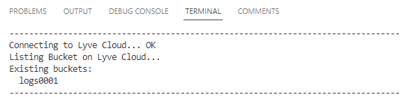

* And for the OpenSearch/ElasticSearch, you should see the output message similar to the one below.

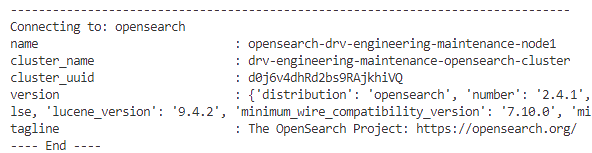

---

If you can see both messages as shown above, you're ready to proceed to the next step (Step 2).

---

<br />

### **Step 2:** Data Ingestion Check

> **Warning:** Please ensure that you have initialized the ISM and Data Stream Index Mapping before performing this operation. Refer to the [Initialize Data Stream Index and Data Policy](#initialize-data-stream-index-and-data-policy) section for more information.

User can specify the starting date (`START_DATETIME`) and ending dates (`STOP_DATETIME`) to extract logs for a specific date range or leave both fields as None. The given datetime must be in the [`ISO-8601`](https://en.wikipedia.org/wiki/ISO_8601) format.


@ Example of Flags in **`setting/my_settings.py`** for data ingestion check.

```py
DEBUG_FLAG          = False

# ---------------------------------------
#        Service Mode
# ---------------------------------------
SERVICE_MODE        = False
RUN_AS_SERVICE      = False
# ---------------------------------------
CONFIG_CHECK        = True
INIT_ISM            = False
INIT_DATA_STREAM    = False

# ---- Setting for one time (batch) download (only if SCHEDULE_RUN=False) ----
START_DATETIME        = '2023-01-20T00:00:00+07:00'
STOP_DATETIME         = '2023-01-22T23:59:59+07:00'

```

After modifying the settings, rerun the program.

* If the program detects the Lyve Cloud Log, you should see an output message and progress bar similar to the ones shown below.

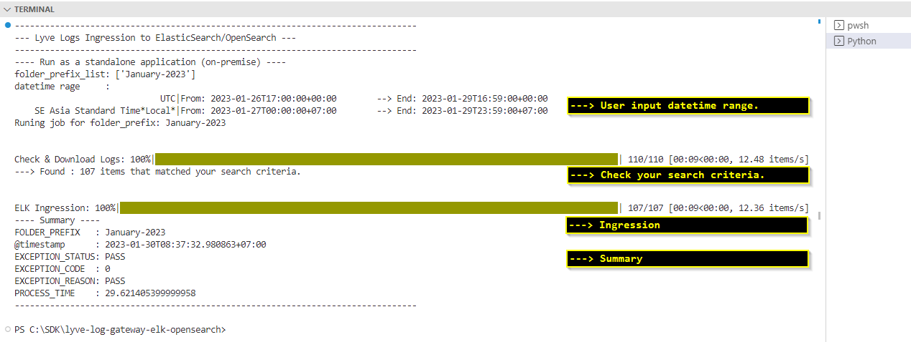

* You can also check the result in **`log/history.csv`**

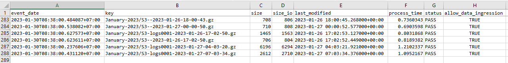


[Back to top](#top)
<br />
<br />


### Initialize Data Stream Index and Data Policy
---

To efficiently manage Lyve Cloud Logs in OpenSearch/ElasticSearch, we store log data in [Data Streams](https://opensearch.org/docs/latest/opensearch/data-streams/) format and manage them through [Index State Management](https://opensearch.org/docs/latest/im-plugin/ism/index/).
You can read more about [Managing time-series data in OpenSearch with data streams](https://docs.aws.amazon.com/opensearch-service/latest/developerguide/data-streams.html).


@ Example of Flags in **`setting/my_settings.py`** for initializing Data Stream Index and Data Policy.

```py
DEBUG_FLAG          = False

# ---------------------------------------
#        Service Mode
# ---------------------------------------
SERVICE_MODE        = True
RUN_AS_SERVICE      = False
# ---------------------------------------
CONFIG_CHECK        = False
INIT_ISM            = True
INIT_DATA_STREAM    = True

```
After modifying the settings, rerun the program.


[Back to top](#top)
<br />
<br />


## Usage
---

### **Option 1:** Run as a Standalone Application

To execute the following commands, type them into a command line prompt.

```
python main.py
```

- If you're running in scheduling mode (`RUN_AS_SERVICE = True`), you can check the service status by navigating to http://localhost:5001/info

- To close the program, press CTRL + C on your keyboard or simply click on X to close the window.

<br />

### **Option 2:** Run as a Service (Docker Container)
> **Warning:** Ensure that the setting is configured to run in scheduling mode (`RUN_AS_SERVICE = True`). Otherwise the program will run and exit immediately.

To execute the following commands, type them into a command line prompt.
1.  Build a docker image
```
docker build -f 'Dockerfile' -t 'lyve-log-gateway-elk-opensearch:latest' .
```

2.  Run a docker image
```
docker run -d 'lyve-log-gateway-elk-opensearch:latest'
```

3. Navigate to http://localhost:5001/info to see the service status.

<br />

[Back to top](#top)
<br />
<br />


### Discover Your Data
---

You can discover your log data that have been ingested into the OpenSearch / ElasticSearch by navigating to the Dashboard URL and login.

### **Step 1:** Log in to Kibana or OpenSearch Dashboard
* Login

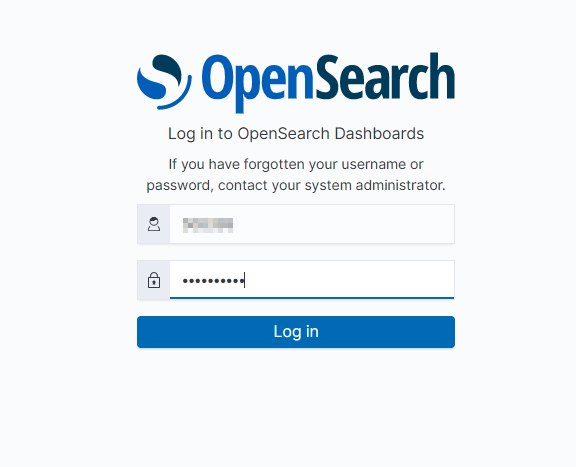

### **Step 2:** Select your workspace (tenant)
* If you have multiple tenants, please switch to the correct one by clicking on the top-right corner and selecting 'Switch tenants'. The 'Select your tenant' screen will then appear.

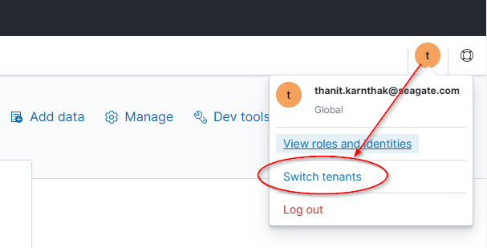


* If you don't have a `tenant: 'lyve-cloud-system-monitoring'`, please create a new one by going to [Security] --> [Tenants] --> [Create tenant].

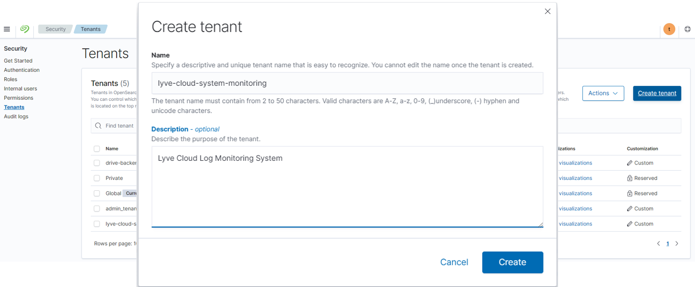


### **Step 3:** Create an index pattern (or create data view)
> * For **Kibana**, Go to [Management] --> [Stack Management] --> [Kibana: Data Views] --> [Create data view].
> * For **OpenSearch Dashboard**, Go to [Management] --> [Stack Management] --> [Index patterns] --> [Create index pattern].

- Create index pattern


- Custom index pattern ID. The **`Index pattern name`** and **`Custom index pattern ID`** must be the same for ease of index reference.

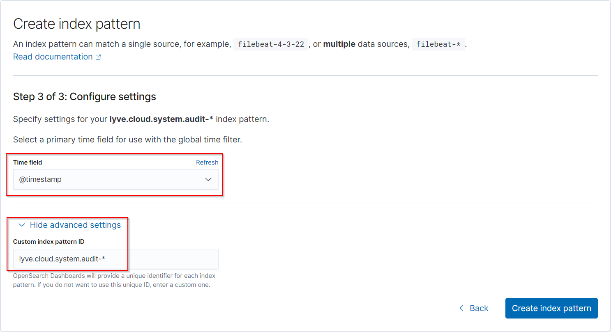


### **Step 4:** Discover your data
Select your index pattern name and specify the datetime range. You should then see some data on this page.

- For **Kibana**, Go to [Analytics] --> [Discover]
- For **OpenSearch Dashboard**, Go to [OpenSearch Dashboard] --> [Discover]

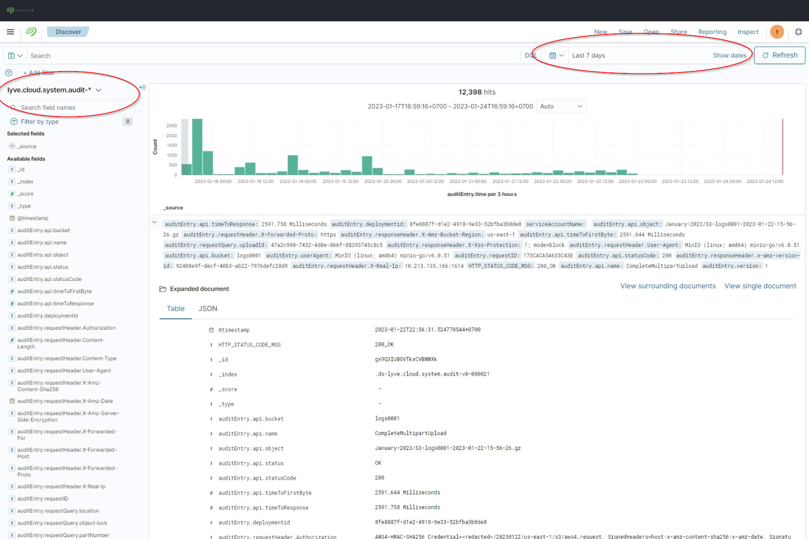


[Back to top](#top)
<br />
<br />


### Dashboard and Visualization
---
To try our demo dashboard and visualization, you will have to import the saved object (`*.ndjson`) file into your prefered tenant. Our dashboard file is located in the path **`example/opensearch/lyve-dashboard.ndjson`*, which includes tenant settings. Please read the warning message below.


> **Warning:** Please make sure to assign the following values to the variables as shown below. Otherwise, you will have to manually edit the saved object file **`lyve-dashboard.ndjson`** using a text editor and perform a Find & Replace operation with the corresponding values before importing it into the OpenSearch Dashboard. Please refer to the Import Saved Objects section of this document. Please note that this saved object file is optimized for use with the **OpenSearch Dashboard -- Dark Theme** only.


@ Example of settings in **`config.yaml`**.
```yaml
opensearch:
  tenant              : 'lyve-cloud-system-monitoring'
  api_audit_index_name: 'lyve.cloud.system.audit-v0'
  iam_index_name      : 'lyve.cloud.system.iam-v0'
  console_index_name  : 'lyve.cloud.system.console-v0'
  parser_index_name   : 'lyve.cloud.system.parser-v0'

```

After importing the dashboard and visualization file, you can view it by navigating to the corresponding page.

#### **Step 1:** Landing Page

* Go to [OpenSearch Dashboards] --> [Dashboard] --> [#Home].

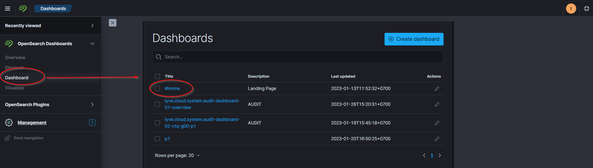

* Click on any item (link) to navigate between pages/ dashboards.

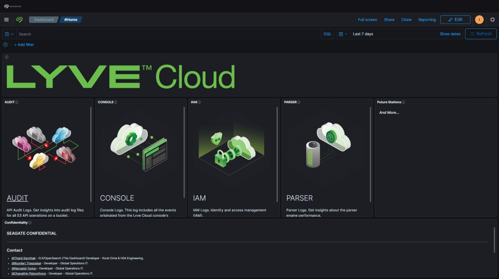
[Back to Dashboard Section](#dashboard-and-visualization)

#### **Step 2:** Example of Overview Dashboard (API Audit Logs)
* This is our overview page for API Audit Logs. You can click on any item, link or visualization on the dashboard to navigate between pages/dashboards and see the details of the log data.

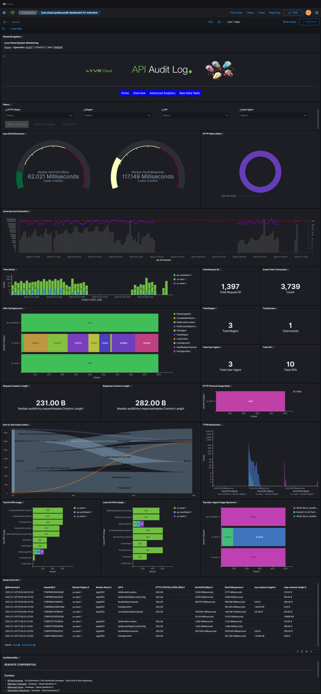
[Back to Dashboard Section](#dashboard-and-visualization)

#### **Step 3:** Example of Advanced Analytics Dashboard (API Audit)
* This is our Advanced Analytics page.

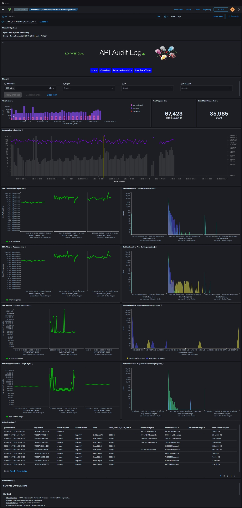
[Back to Dashboard Section](#dashboard-and-visualization)

#### **Step 4:** Play with Interactive Dashboard
* You can drag & drop on timeseries visualization in order to apply time filter.

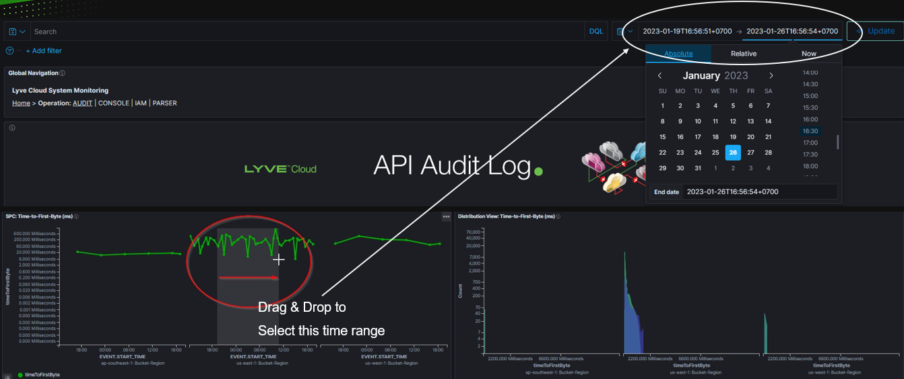

* You can mostly click on any objects/items in order to apply filters.


* You can hover your mouse pointer on any objects to see info tooltip.

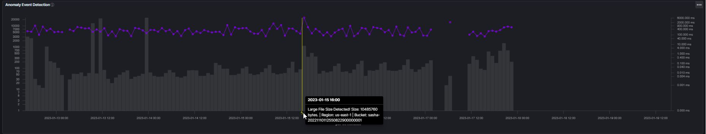

[Back to Dashboard Section](#dashboard-and-visualization)


#### **Step 5:** Apply Advanced Filters
* You can filter on any available data fields.

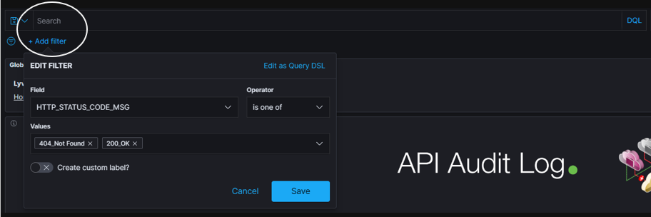
[Back to Dashboard Section](#dashboard-and-visualization)


#### **Step 6:** Pin Filters
* You can pin filters to use them across pages/dashboards.


[Back to Dashboard Section](#dashboard-and-visualization)

[Back to top](#top)
<br />
<br />


### Import Saved Objects
---

> **Warning:** It is recommended to start with a clean & empty workspace/tenant.

To import saved objects to the current tenant (workspace)...
* For **OpenSearch Dashboard**, Go to [Management] --> [Stack Management] --> [Saved Objects] --> [Import].

Once you have imported the saved objects into the current tenant, you will need to refresh/reload the website to see the new dashboard and visualizations.

<br />

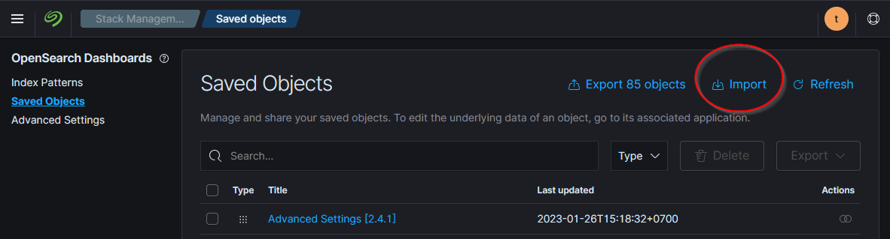

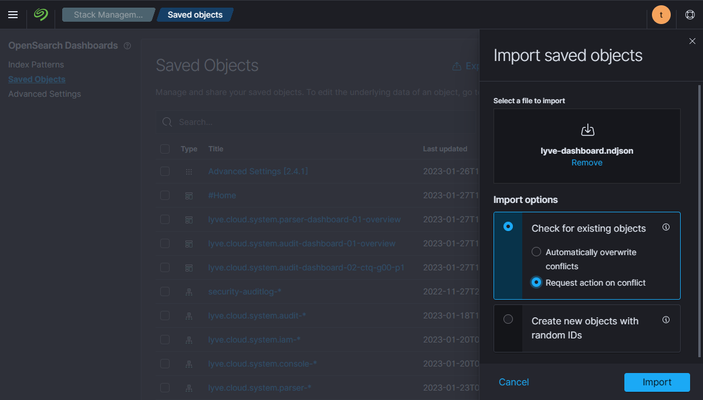


[Back to top](#top)
<br />
<br />


## Status
---
Project is _completed._

<br />
<br />

## To Do Lists
---
* NA

<br />
<br />

## GitLab Repository
* https://seagit.okla.seagate.com/kor-lyve-dev/log-gateway-elk-opensearch
* https://github.com/Seagate/Lyve-Cloud-Solutions-Samples

<br />
<br />


## Tested By
---
* 2023.01.30, [@Thanit Karnthak](https://seagit.okla.seagate.com/508399) on Windows 10 .

<br />
<br />


## Contact
---
* [@Thanit Karnthak](https://seagit.okla.seagate.com/508399) - Project Lead/Developer - Korat Drive Operation.
* [@Boonlert Thappaisal](https://seagit.okla.seagate.com/25408) - Mentor/Co-Developer - IT-FIS.

<br />
<br />

## License
---
[Copyright (C) 2021, Seagate Technology.](https://my.seagate.com/myseagate)

<br />

[Back to top](#top)
